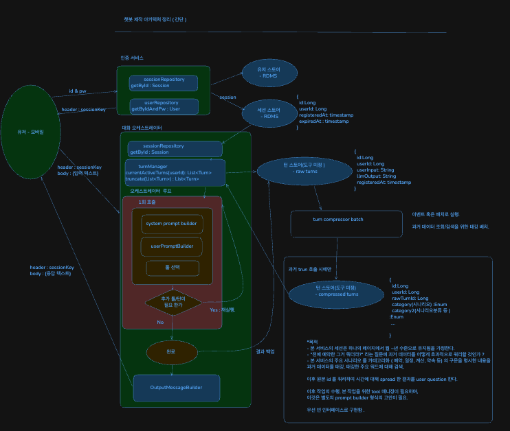

# 브라보 챗 (Bravo Chat)

> 장기간·일상 도움·기록을 하나로 모아, 대화에서 최대한 정보를 뽑아내는(aggregate) 개인 챗봇.
> **중간 점검용 README** — 지금까지 진행 상황과 폴더 구성을 한눈에 보기 위한 문서입니다.

## 0. 개요

현재 진행 상황을 한 줄로 요약하면:

| 영역 | 상태                | 메모                    | todo                                      |
| --- |-------------------|-----------------------|-------------------------------------------|
| **be** (백엔드) | 🟢 기능 테스트 환경 구축.  | 순수 챗봇 역할 + 구조적 케어     | 대화 완성도 높이기, tool 에 대한 케어 , memory 완성도 높이기. |
| **fe** (프론트) | 🟢디자인만            | 간단한 로그인 & 챗 상황만 구현    | 전반적  완성도 미흡                               | 
| infra | ⚪ 예정              | 일단 로컬에서 실행 환경을 지원할 예정 |                                           |

**be — 완성된 80%의 내용**

- **순수 챗봇 역할** 및 **프롬프트에 대한 교체 용이한 구조** (`SystemPromptBuilder` — 시스템 프롬프트를 섹션 단위로 조립)
- **관리 차원의 케어** — 모든 대화를 `Turn` / `TurnEvent` 로 전량 기록하고 감사(createdAt/updatedAt) 관리, 최근 대화 aggregate 조회

> 남은 20%는 SendMessage 오케스트레이션(LLM 툴 콜링 루프)과 자동 테스트입니다. → [be/README.md](be/README.md)

**fe** 는 디자인 테마와 데모 UI가 있으나, 아직 프로젝트 구성이 안 된 상황입니다.

가격에 대한 예측 & 비교는 [해결해야_하는_것.md](해결해야_하는_것.md) 에 추정치를 올려놓았습니다.
(캐시가 없는 가격이라 실제로는 1/3 ~ 2/3 수준을 예상)

### 목차

1. [폴더별 스펙](#1-폴더별-스펙)
2. [챗봇 데모 UI](#2-챗봇-데모-ui)
3. [루프 구성](#3-루프-구성)
4. [클로드 코드 프롬프트 구성 및 구조](#4-클로드-코드-프롬프트-구성-및-구조)

---

## 1. 폴더별 스펙

### `be/` — 백엔드

- **역할**: 챗봇 대화 처리(인증 · 대화 기록 · LLM 오케스트레이션)와 관리용 데이터 aggregate.
- **프레임워크 & 버전**: Spring Boot **3.2.1** / Java **21** / Spring Data JDBC / H2 / Gradle 8.5
- **아키텍처**: 멀티모듈 (api · service · infrastructure · repository-jdbc · model · schema · exception · applications) + LLM 모듈 `llm-openai` (Spring AI 1.1.0)
- 상세: [be/README.md](be/README.md)

### `fe/` — 프론트엔드

- 디자인 테마와 데모 UI 존재. 프로젝트 구성은 아직.

### `design_and_idea/` — 디자인 & 아이디어 (임시 업로드)

작업 중 임시로 올려둔 자료 모음:

- `브라보 챗 테마 시안 비교/` — 테마 시안 HTML(`*.dc.html`), 데모 UI 대표 이미지(`시안대표.png`), 마스코트 에셋(`assets/mascot-*.png`)
- `컨셉-이미지.png` — 초기 UI 컨셉 스케치(마스코트 · 대화 타입 1/2/3 · 위젯)
- `클로드_코드_프롬프트_보기/` — **클로드 코드 프롬프트 구성 분석** 자료 위치 (아래 4번 참고)

### `infra/` — 인프라

- 일단 로컬에서 실행 환경을 지원할 예정.

---

## 2. 챗봇 데모 UI


현재 **디자인 스펙 테마 & 컴포넌트 구성 계획 완료**.

---

## 3. 루프 구성



아래 [클로드 코드 챗봇 구성](#4-클로드-코드-프롬프트-구성-및-구조)을 간단하게 따온 구조입니다.

- 기본적으로 대화가 진행됨에 따라 이전 turn 을 append 하는 구조로 **캐시 히트를 최대화**합니다.
- long term 특성상, 오래된 컨텍스트에 대한 추가적인 **태깅 & 검색** 케어가 필요합니다. (이 부분은 MVP 이후에 조정하면서 구현 예정)
- 툴 / 일반 호출은 아래 수도 코드를 따릅니다.

```
while true:
    assistant = callModel(messages, tools)

    if assistant.hasNoToolUse():
        return completed

    results = runTools(assistant.toolUses)

    messages += assistant
    messages += results
```

---

## 4. 클로드 코드 프롬프트 구성 및 구조

별도 문서로 정리되어 있습니다.

- **브라보 시스템 프롬프트 구성/구조** (be) → [be/additional_resources/system-prompt-complete.md](be/additional_resources/system-prompt-complete.md)
- 참고 — 클로드 코드 프롬프트 분석 원본 → [design_and_idea/클로드_코드_프롬프트_보기/](design_and_idea/클로드_코드_프롬프트_보기/)
